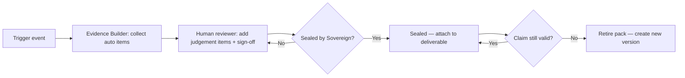

# Evidence Pack — حزمة الأدلة

> المرجع: §40 من المواصفة الأصلية.

---

## ما هي Evidence Pack؟

حزمة دليل = **مجموعة موثَّقة من الأدلة** تُولَّد تلقائيًا أو شبه تلقائيًا قبل/أثناء/بعد إجراء مهم. لا تُبنى عبثًا — هناك 8 محفِّزات صريحة. بعد البناء، تُؤرشَف في Evidence Vault داخل [TRUST_WORKSPACE_AR.md](TRUST_WORKSPACE_AR.md) ويمكن إرفاقها بأي مقترح، تقرير، أو Audit.

الفلسفة: **لا ادعاء بلا حزمة**. الـ Evidence Pack ليست "ميزة"، هي شرط شرعية للحديث الخارجي.

---

## Evidence Pack — schema

```json
{
  "pack_id": "ev_pack_XXXX",
  "trigger": "enum (anchor — see triggers list below)",
  "subject": {
    "kind": "opportunity | customer | partner | vertical | tool | api | workflow",
    "id": "string"
  },
  "created_at": "ISO timestamp",
  "created_by": {
    "kind": "agent | human | system",
    "id": "string"
  },
  "items": [
    {
      "item_type": "source_passport | claim | citation | screenshot | dataset_ref | policy_ref | test_result | sign_off",
      "title_ar": "string",
      "title_en": "string",
      "body": "string",
      "source_ref": "string (URI, doc path, dataset id, …)",
      "confidence": "low | medium | high",
      "limitations": ["string"]
    }
  ],
  "claims": [
    {
      "claim_ar": "string",
      "claim_en": "string",
      "supported_by": ["item_index"],
      "value_type": "estimated | observed | verified"
    }
  ],
  "exclusions": ["string"],
  "compliance_refs": ["string (PDPL, allowed use, channel policy …)"],
  "sign_offs": [
    {"role": "internal_reviewer | sovereign", "actor_id": "string", "timestamp": "ISO"}
  ],
  "version": "1.0",
  "status": "draft | reviewed | sealed | retired"
}
```

---

## شرح الحقول الرئيسة

- **trigger**: المحفّز الذي أوجب بناء الحزمة (أحد الثمانية أدناه).
- **subject**: ما الذي تتحدث عنه الحزمة (فرصة محددة، عميل، شريك، قطاع، أداة، API، تدفق عمل).
- **items**: لبنات الدليل. كل عنصر له نوع محدد:
  - `source_passport`: جواز مصدر بيانات (راجع `docs/04_data_os/SOURCE_PASSPORT.md`).
  - `claim`: ادعاء واضح يجب أن يُدعَم.
  - `citation`: مرجع خارجي.
  - `screenshot`: لقطة سياقية.
  - `dataset_ref`: مرجع بياناتي.
  - `policy_ref`: سياسة منطبقة.
  - `test_result`: نتيجة اختبار.
  - `sign_off`: اعتماد بشري.
- **claims**: كل ادعاء يُربط صراحة بـ items مُسانِدة + يُصنَّف Estimated/Observed/Verified.
- **exclusions**: ما **لم** تشمله الحزمة (ضروري لمنع التوسع الضمني).
- **compliance_refs**: مراجع PDPL، Allowed Use، Channel Policy ذات الصلة.
- **sign_offs**: مَن راجَع وأقرّ.
- **status**:
  - `draft`: قيد البناء.
  - `reviewed`: راجَعها بشر.
  - `sealed`: مُختومة، لا تُعدَّل بعد ذلك (أي تغيير = إصدار جديد).
  - `retired`: مُحالة للأرشيف (مثلًا لأن الادعاء لم يعد ساريًا).

---

## الـ 8 محفِّزات لإنتاج Evidence Pack

| # | المحفِّز | لماذا يستوجب حزمة |
|---|---|---|
| 1 | **Enterprise proposal** | عرض لعميل enterprise يستوجب أدلة على القدرة، السلامة، الأداء، PDPL |
| 2 | **AI Trust Kit** | منتج Dealix الرسمي لإثبات حوكمة الذكاء الاصطناعي — مكوّن من حزمة موسَّعة |
| 3 | **Strategic partnership** | شراكة استراتيجية تتطلب أدلة جدوى متبادلة + توافق سياسات |
| 4 | **Public API** | فتح API للعموم يستوجب أدلة أمان، إقامة بيانات، حدود استخدام، طرق إساءة |
| 5 | **Marketplace listing** | إدراج خدمة/أداة في Marketplace يستوجب أدلة منشأ، توقيع، توافق |
| 6 | **MCP server** | تشغيل MCP server (أداة قابلة للاستدعاء من نماذج خارجية) يستوجب أدلة Tool Registry، semantic vetting، egress controls (راجع [TRUST_WORKSPACE_AR.md](TRUST_WORKSPACE_AR.md)) |
| 7 | **New vertical launch** | قطاع جديد ينتقل من Venture إلى Internal يستوجب حزمة أدلة proof (راجع [VENTURE_WORKSPACE_AR.md](VENTURE_WORKSPACE_AR.md)) |
| 8 | **Sensitive data workflow** | أي تدفق عمل يتعامل مع PII/مالي/صحي يستوجب أدلة PDPL، تصنيف، استبقاء، حدود وصول |

---

## مَن يبني الحزمة؟

- **التحفيز التلقائي**: Hermes يطلق `trust.evidence_pack_built` تلقائيًا عند الحدث المحفِّز.
- **البناء**: Evidence Builder (مكوِّن داخلي) يجمع العناصر القابلة للجمع تلقائيًا (source passports, datasets, policies).
- **الإكمال البشري**: مُراجِع داخلي يضيف العناصر التي تحتاج حكمًا بشريًا (sign-offs, limitations, claims classification).
- **الختم (seal)**: Sovereign أو مُفوَّض مُحدَّد، بحسب المحفِّز.

---

## دورة حياة الحزمة



---

## قواعد الاستخدام

1. **لا تُرسَل حزمة مفتوحة (draft) خارج Dealix.** فقط `sealed`.
2. **كل ادعاء بدون item داعم = رفض الحزمة.**
3. **العميل/الشريك يستلم نسخة قراءة فقط**، لا يعدّل.
4. **انتهاء صلاحية ضمني**: حزم > 12 شهرًا تُعاد مراجعتها قبل إعادة الاستخدام.
5. **حزمة retired** لا تُحذَف — تُحفَظ للتدقيق التاريخي.

---

## ربط بـ Customer Value Report

تقرير القيمة الشهري في [CUSTOMER_WORKSPACE_AR.md](CUSTOMER_WORKSPACE_AR.md) يستند على Evidence Packs المختومة، ولا يحتوي ادعاءً غير مدعوم بحزمة.

---

## English Summary

- An Evidence Pack is a structured, signed bundle of items that supports any external claim Dealix makes; the rule is "no claim without a pack."
- The schema captures items (source passports, claims, citations, screenshots, datasets, policies, test results, sign-offs), explicit exclusions, compliance refs, and lifecycle status (draft → reviewed → sealed → retired).
- Eight explicit triggers force pack creation: Enterprise proposal, AI Trust Kit, Strategic partnership, Public API, Marketplace listing, MCP server, New vertical launch, Sensitive data workflow.
- Packs are auto-started by Hermes, completed by a human reviewer, and sealed by Sovereign (or a delegate) before any external use.
- Sealed packs are immutable; revisions require a new version, and retired packs are kept for historical audit.
