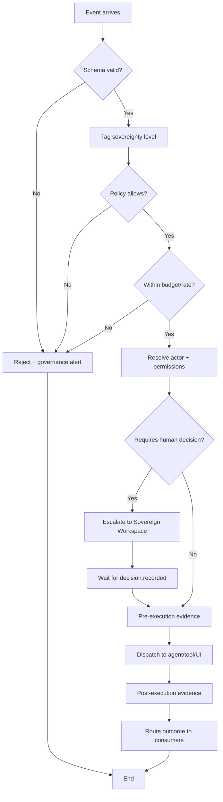

# Hermes Orchestrator — الموزِّع السيادي

> المرجع: §28 من المواصفة الأصلية.

---

## التعريف

Hermes هو **kernel** نظام Dealix. ليس وكيلاً، وليس واجهة، وليس قاعدة بيانات — هو الطبقة التي تقرّر **ماذا يحدث**، **من ينفّذ**، **متى يُسمح**، و**ما الذي يُسجَّل**. كل حدث (راجع [HERMES_EVENT_MODEL_AR.md](HERMES_EVENT_MODEL_AR.md)) يمرّ عبر Hermes قبل أن يصل إلى أي مستهلك.

Hermes يلعب أربعة أدوار في وقت واحد:

| الدور | الوظيفة | المنطق الجوهري |
|---|---|---|
| **Router** | يوزّع الأحداث على المُستهلكين | "من يهمّه هذا؟" |
| **Evaluator** | يفحص الحدث/الطلب مقابل السياسات | "هل يحقّ هذا الفعل الآن؟" |
| **Governor** | يفرض الحدود (cost, rate, blast radius) | "هل تجاوزنا حدودًا؟" |
| **Dispatcher** | يستدعي الوكلاء/الأدوات/الواجهات | "نفّذ الآن مع هذه الصلاحيات" |

---

## الـ 12 وظيفة الجوهرية

1. **Event ingestion** — استقبال أي حدث من أي مصدر داخل النظام.
2. **Schema validation** — رفض أي حدث غير مطابق للنموذج القياسي.
3. **Sovereignty tagging** — وسم مستوى السيادة قبل التوزيع.
4. **Policy evaluation** — تطبيق سياسات [RISK_MODEL_AR.md](RISK_MODEL_AR.md) و[QUALITY_GATES_AR.md](QUALITY_GATES_AR.md).
5. **Routing** — تسليم الحدث للـ workspaces والمكونات المُصرَّح لها فقط.
6. **Agent dispatch** — استدعاء الوكلاء مع صلاحيات L0–L6 محددة.
7. **Tool brokering** — توسيط استدعاءات الأدوات وفق Tool Registry (يخضع لـ [TRUST_WORKSPACE_AR.md](TRUST_WORKSPACE_AR.md)).
8. **Cost & rate governance** — إيقاف أي تشغيل يتجاوز حدود التكلفة أو المعدل.
9. **Evidence collection** — جمع الأدلة على القرار/التنفيذ تلقائيًا.
10. **Decision escalation** — رفع الحدث للـ Sovereign Workspace إن تطلّب قرارًا بشريًا.
11. **Audit logging** — كتابة سلسلة سببية كاملة (trace) لكل حدث.
12. **Kill propagation** — تنفيذ Kill Switch فورًا حين يصدر من Sovereign.

---

## الـ 9 خطوات لقرار Hermes

عند وصول طلب/حدث، Hermes يمرّ بهذه الخطوات بهذا الترتيب:

1. **Validate** — تطابق Schema؟
2. **Tag sovereignty** — على أي مستوى يجب أن يُعالَج؟
3. **Check policy** — هل السياسات الحالية تسمح؟
4. **Check budget** — هل ضمن حد التكلفة/المعدل؟
5. **Resolve actor** — من سيُنفّذ (وكيل؟ نظام؟ بشر؟)؟
6. **Resolve permissions** — أي مستوى L0–L6 مطلوب؟ هل المُنفِّذ يملكه؟
7. **Pre-execution evidence** — تسجيل النية والمدخلات.
8. **Dispatch** — تنفيذ الفعل أو رفع decision request.
9. **Post-execution evidence + route outcome** — تسجيل النتيجة وتوزيعها.

أي خطوة فاشلة تُنتج `governance.alert` وتوقف السلسلة.

---

## مخطط معماري

---

## ما لا يفعله Hermes

- **لا يقرّر بنفسه** قرارات استراتيجية — يرفعها للـ Sovereign.
- **لا يُخزّن البيانات** — يكتب في السجلات المتخصصة (Event Store, Decision Journal, Evidence Store).
- **لا يتجاوز عزل الـ workspaces** — حتى لو طُلب منه ذلك برمجيًا.
- **لا يُنشئ أدوات أو وكلاء جدد** بنفسه — هذا قرار سيادي يمر عبر Tool/Agent Control في [SAMI_SOVEREIGN_WORKSPACE_AR.md](SAMI_SOVEREIGN_WORKSPACE_AR.md).

---

## العلاقة بمكونات النظام الأخرى

- **Trust Workspace** يراقب جودة عمل Hermes (هل البوابات تعمل؟ هل في تجاوزات؟).
- **Sovereign Workspace** يملك Hermes (Kill Switch، تعديل السياسات، رفع الصلاحيات).
- **Internal Workspace** يستهلك توجيهات Hermes للتشغيل اليومي.
- **Customer/Partner Workspaces** ترى فقط ما يسمح Hermes بعرضه.

---

## English Summary

- Hermes is the kernel of Dealix Max OS — a router, evaluator, governor, and dispatcher rolled into one layer.
- It exposes 12 core functions covering ingestion, validation, policy checks, dispatch, evidence collection, and kill-switch propagation.
- Every event passes through a 9-step decision flow; any failure produces a `governance.alert` and halts the chain.
- Hermes does not make strategic decisions, does not store data directly, and cannot bypass workspace isolation — those boundaries are by design.
- All other workspaces interact with the system only through Hermes-mediated events and dispatches.
