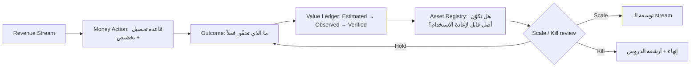

# Money Flow + Sami Personal Wealth OS

> المرجع: §44 (11 مصدر دخل + Money Engine) و §45 (Personal Wealth OS).

---

## القسم الأول — الـ 11 مصدر دخل

Money Engine في Dealix يستقبل تدفقات من 11 مصدرًا مختلفًا. لكل مصدر **منطق Money Action** خاص، يحوّله إلى **Outcome**، ثم إلى **Asset**، ثم يخضع لقرار **Scale/Kill** (راجع [SCALE_KILL_PLAYBOOK_AR.md](SCALE_KILL_PLAYBOOK_AR.md)).

| # | Revenue Stream | Money Action | Outcome | Asset قابل للتوليد | Scale/Kill |
|---|---|---|---|---|---|
| 1 | **Diagnostics (Governed Revenue Diagnostic)** | تحصيل دفعة واحدة + تخصيص delivery | Proof Pack مُسلَّم | قالب تشخيص + Insight ICP | يُتوسَّع إن Time-to-Proof < threshold |
| 2 | **Sprints (Revenue Intelligence Sprint وغيرها)** | دفعة + جدول تسليم | KPI lift موثَّق | playbook قابل للنسخ بين القطاعات | يُتوسَّع بقطاعات جديدة |
| 3 | **Retainers (Control Tower / Ops Retainer)** | دفع شهري متكرّر | تشغيل مستمر + Value Reports شهرية | علاقة طويلة الأمد + بيانات تاريخية | يُكرَّر مع عملاء مشابهين |
| 4 | **AI Trust Kit** | دفعة محدّدة + Evidence Pack موسَّعة | إثبات حوكمة موثَّق | قوالب Trust + Audit-ready bundle | يُتوسَّع لكل enterprise جديد |
| 5 | **White-label Partner Royalties** | تسوية شهرية/ربع سنوية بالنسبة | إيراد متكرّر دون تشغيل مباشر | شبكة شركاء | يُتوسَّع بإضافة شركاء جدد ضمن الشروط |
| 6 | **Marketplace Listings** | عمولة على كل listing نشط | إيراد منخفض-التشغيل، high-leverage | قوائم خدمات/أدوات معتمدة | يُتوسَّع بضوابط Trust |
| 7 | **Public API Subscriptions** | اشتراك شهري/سنوي | استخدام مُقاس + التزام guardrails | API surface مستقر | يُتوسَّع وفق quota patterns |
| 8 | **Training & Certification** | رسوم برنامج/شهادة | كادر مُؤهَّل (داخلي وخارجي) | منهج + شبكة خريجين | يُتوسَّع بنسخ بـ لغة/قطاع جديد |
| 9 | **Content / IP licensing** | ترخيص محتوى متخصص (تقارير، playbooks) | إيراد من أصل موجود | مكتبة محتوى مرخَّصة | يُتوسَّع لكل قارئ مدفوع |
| 10 | **Venture Studio Outcomes** | حصص في verticals جديدة ناجحة | عوائد طويلة الأجل من شركات منفصلة | مَحفظة venture | يُقرَّر سيادي |
| 11 | **Strategic Engagements** | عقود استشارية كبيرة (Enterprise) | تأثير + إيراد + علاقات | حالات مرجعية | يُتوسَّع باستنساخ النمط |

---

## كيف يتدفق المصدر داخل Money Engine

---

## قواعد Money Engine

1. **كل دفعة تُسجَّل كحدث** — لا نقد خارج Event Bus.
2. **Estimated ≠ Verified.** الإيراد المُتوقَّع لا يُسجَّل كـ Verified إلا بعد تسوية فعلية (راجع `docs/08_value_os/ESTIMATED_OBSERVED_VERIFIED_VALUE.md`).
3. **Bad revenue رفض.** بعض الإيرادات تُرفَض حتى لو كانت متاحة (راجع `docs/00_constitution/GOOD_REVENUE_BAD_REVENUE.md`).
4. **كل stream له owner داخلي** يظهر في Internal Workspace.
5. **Sovereign يرى المجموع + التركيز** على Money Command Page.

---

## القسم الثاني — Sami Personal Wealth OS (§45)

Sovereign Workspace ليست لإدارة الشركة فقط. تتضمن **OS مصغَّر لإدارة الثروة الشخصية للمؤسس**، بنفس مبادئ السيادة، العزل، والـ Evidence-first.

السبب: السيادة واحدة. القرار في النهاية يتم بين رأس واحد، لذا يجب أن يكون السياق الشخصي والمؤسسي قابلين للرؤية في موضع واحد دون خلط الحسابات.

### الـ 7 وحدات الشخصية

| # | الوحدة | الغرض | المؤشر الرئيس |
|---|---|---|---|
| 1 | **Liquidity** | السيولة المتاحة فورًا (حسابات، نقد، استثمارات قابلة للتسييل خلال 7 أيام) | بنطاقات: أحمر / أصفر / أخضر |
| 2 | **Concentration** | تركيز الأصول (هل > x% من الثروة في فئة واحدة؟) | نسبة أعلى تركيز |
| 3 | **Cash Conversion** | زمن تحويل أي أصل إلى نقد (ladder) | متوسط زمن تسييل |
| 4 | **Income Mix** | مصادر الدخل الشخصية (راتب/توزيعات Dealix/استثمارات/أخرى) ومدى تنوّعها | عدد المصادر + نسبة كل منها |
| 5 | **Personal Burn vs Runway** | تكلفة شخصية شهرية مقابل عدد الأشهر التي تغطّيها السيولة الحالية | أشهر التغطية |
| 6 | **Asset Productivity** | أي أصل ينتج عائدًا، أيها خامل (مع تكلفة احتفاظ) | تصنيف productive / dormant / cost |
| 7 | **Tax + Zakat Posture** | الموقف الزكوي والضريبي الحالي + المواعيد القادمة | تاريخ آخر مراجعة + تاريخ التالي |

---

### قواعد فصل القطاع الشخصي عن المؤسسي

1. **بيانات منفصلة.** Personal Wealth OS له تخزينه الخاص — لا تختلط بحسابات Dealix.
2. **لا يراها أي workspace آخر** — حتى Trust لا تصل لها. مرئية فقط لـ Sovereign.
3. **Hermes يفرّق التدفقات** — توزيعات من Dealix إلى المؤسس تُسجَّل كحدث في Money Engine، ثم تُعبر "حد سيادي" وتُسجَّل في Personal Wealth OS كحدث منفصل.
4. **قرارات الـ Personal Wealth لا تخضع لـ Scale/Kill Playbook** — لها مبادئ أبسط: حماية، تنويع، سيولة.
5. **لا تُذكَر في أي تقرير عميل/شريك/داخلي.**

---

### تكامل مع Command Page

ويدجت "Personal Wealth Pulse" في Command Page يعرض ملخّصًا فقط:

- Liquidity band (أخضر/أصفر/أحمر)
- Concentration alert (yes/no)
- Personal runway band
- Zakat reminder (إن قرب)

التفاصيل تُفتح في صفحة منفصلة لا تظهر إلا داخل Sovereign Workspace.

---

## English Summary

- Dealix Money Engine receives revenue from 11 streams (Diagnostics, Sprints, Retainers, AI Trust Kit, White-label royalties, Marketplace, Public API, Training, IP licensing, Venture outcomes, Strategic engagements), each with its own action → outcome → asset → scale/kill flow.
- Every payment is an event; Estimated revenue is never logged as Verified until settlement; Bad revenue is rejected even when available.
- The Sami Personal Wealth OS is a separate sub-system inside the Sovereign Workspace with seven modules (Liquidity, Concentration, Cash Conversion, Income Mix, Personal Burn/Runway, Asset Productivity, Tax & Zakat).
- Personal wealth data is isolated from every other workspace, including Trust; only the Sovereign user can see it.
- A single Personal Wealth Pulse widget surfaces a minimal summary in the Command Page; detail lives in a Sovereign-only sub-page.
