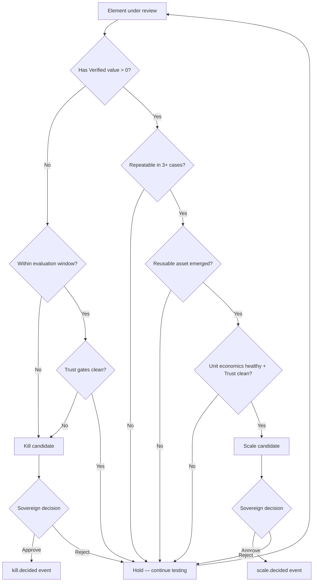

# Scale / Kill Playbook — قواعد التوسيع والإنهاء

> المرجع: §46 من المواصفة الأصلية.

---

## القاعدة الجوهرية

> **لا عاطفة.**

Scale أو Kill ليس قرارًا ذوقيًا، ولا قرارًا مرتبطًا بزمن استثمار سابق. القرار يُتَّخذ على **بيانات**: أصل ينتج أو لا ينتج، قطاع يصل لـ KPI أو لا يصل، منتج يُكرَّر بنجاح أو يفشل في التكرار.

> ⚠ **sunk cost لا يُعتدّ به.** كل ما أُنفق سابقًا غير قابل للاسترداد، ولا يجب أن يدخل في حساب قرار اليوم.

---

## ماذا نُقيِّم؟

- **أصول** (assets): قوالب، playbooks، عقود إطارية، حِزَم بيانات.
- **منتجات** (offers): العروض الظاهرة في [PRODUCT_SURFACE_AR.md](PRODUCT_SURFACE_AR.md).
- **قطاعات** (verticals): البطاقات في [VENTURE_WORKSPACE_AR.md](VENTURE_WORKSPACE_AR.md).
- **شركاء**: علاقات Partner.
- **أدوات / وكلاء**: التسجيلات في Tool/Agent Registry.

---

## 6+ شروط للـ Scale

أي عنصر يستوفي **3 على الأقل** من هذه الشروط يُرشَّح للـ Scale:

1. **Repeatable proof** — Proof Pack مكتمل ومُتكرّر في ≥ 3 حالات مستقلة.
2. **Positive Verified value** — قيمة مُتحقَّقة (لا تقديرية) موجبة على دورة كاملة.
3. **Reusable asset** — مخرجاته أصبحت أصلًا يُعاد استخدامه بتكلفة هامشية منخفضة.
4. **Customer pull** — طلب متكرّر من السوق دون دفع بشري كثيف.
5. **Healthy unit economics** — التكلفة الكلية للوحدة < سعرها بهامش يحتمل التشغيل.
6. **Trust gates clean** — لا تنبيهات Critical/High في آخر دورة مراجعة.
7. **Partner-able** (إن وُجد) — يمكن تقديمه عبر شريك دون تخفيف في الجودة.
8. **Sovereign green-light** — يتوافق مع استراتيجية المرحلة الحالية.

---

## 6+ شروط للـ Kill

أي عنصر يستوفي **2 على الأقل** من هذه الشروط يُرشَّح للـ Kill:

1. **No proof after window** — لا Proof Pack بعد انتهاء نافذة التقييم المُتفق عليها.
2. **Negative or flat Verified value** — قيمة مُتحقَّقة سلبية أو ثابتة على دورات متعددة.
3. **Repeated quality gate failures** — رفض متكرّر في بوابات الجودة (راجع [QUALITY_GATES_AR.md](QUALITY_GATES_AR.md)).
4. **Risk register escalation** — انتقل خطر مرتبط به إلى مستوى Critical (راجع [RISK_MODEL_AR.md](RISK_MODEL_AR.md)).
5. **Cost runaway** — تكلفته الفعلية تجاوزت السقف بنسبة مرتفعة دون تبرير قيمة.
6. **Channel/PDPL violation pressure** — مطلوب لتشغيله تجاوز قنوات أو قواعد بيانات حساسة.
7. **Strategic drift** — لم يعد متماشيًا مع اتجاه الـ Sovereign الاستراتيجي.
8. **Partner abuse risk** — يخلق سطح هجوم/إساءة استخدام لا يمكن ضبطه.

---

## شجرة القرار

---

## دورة المراجعة

- **أصول / منتجات**: شهريًا.
- **قطاعات (verticals)**: عند كل `next_review_date` المُسجَّل في Vertical Card.
- **شركاء**: ربع سنويًا.
- **أدوات / وكلاء**: شهريًا في Trust Workspace + مراجعة فورية عند أي تنبيه Critical.

---

## آلية اتخاذ القرار

1. **Venture / Internal / Trust** تُرفِق توصية في صفحة Approvals الخاصة بـ Sovereign.
2. **Sovereign** يفتح Strategic Decisions ويراجع: التوصية + الأدلة + المخاطر + Sunk-cost reminder.
3. **القرار** يُسجَّل في Decision Journal مع المبررات.
4. **الحدث**: `scale.decided` أو `kill.decided` (راجع [HERMES_EVENT_MODEL_AR.md](HERMES_EVENT_MODEL_AR.md)) يُنشَر.
5. **Hermes** ينفّذ القرار:
   - **Scale**: نقل العنصر إلى Internal/Customer Surface، إضافة لـ Product Catalog، إعلام الفريق.
   - **Kill**: إيقاف فوري، تجميد التشغيلات، أرشفة الأصول، إخطار الشركاء والعملاء المتأثرين، تسجيل الدروس.

---

## الـ Anchor النفسي

ثلاث جمل تُذكَّر بها في كل مراجعة:

1. **"ما أُنفق لا يعود."**
2. **"النية الحسنة ليست عذرًا للأداء السيئ."**
3. **"الإنهاء قرار شجاع كما هو التوسيع."**

---

## ما لا يُقرَّر هنا

- **قرارات حوكمة طارئة** (Kill Switch لتنبيه Critical لحظي) — تُتَّخذ فورًا من Sovereign دون انتظار دورة المراجعة.
- **قرارات تتعلق بالـ Personal Wealth** — لا تخضع لهذا الـ playbook؛ لها زواياها الخاصة في Sovereign.

---

## English Summary

- The Scale/Kill Playbook is rule-based, not emotional; sunk cost is explicitly disregarded.
- Six-plus Scale conditions (repeatable proof, positive Verified value, reusable asset, customer pull, healthy unit economics, clean trust gates, partner-ability, Sovereign alignment) — three required to nominate for Scale.
- Six-plus Kill conditions (no proof in window, flat/negative Verified value, repeated gate failures, Critical risk escalation, cost runaway, channel/PDPL pressure, strategic drift, partner abuse risk) — two required to nominate for Kill.
- A decision tree formalizes the review flow; final calls land in the Sovereign Strategic Decisions page and are journaled.
- Three anchor sentences keep reviews honest: spent money does not return, good intent does not excuse bad performance, ending is as brave as scaling.
