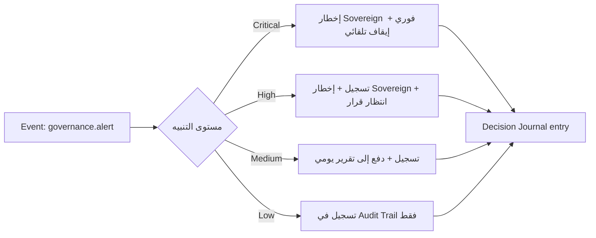

# Trust Workspace — مساحة الحوكمة والثقة

> المرجع: §34 من المواصفة الأصلية.

---

## ما هذه المساحة؟

Trust Workspace هي **مرصد الحوكمة** لكل ما يجري في Dealix. لا تُنفّذ شيئًا، لا تخدم عميلًا، لا تُولّد إيرادًا — مهمتها الوحيدة أن تضمن أن كل شيء يحدث في باقي الـ workspaces يلتزم بالسياسات، يمرّ ببوابات الجودة، ولا يُكوّن خطرًا غير مُدار.

Trust تخدم Sovereign بشكل أساسي. الفريق الداخلي يقرأ سياساتها (read-only)، لكن لا يعدّلها. القرارات الكبرى للسياسات تُتَّخذ من Sovereign بناءً على بيانات Trust.

---

## الـ 9 صفحات

| # | الصفحة | الغرض |
|---|---|---|
| 1 | **Policy Registry** | كل السياسات النشطة (Quality Gates، Risk Model، PDPL، Channel) |
| 2 | **Active Alerts** | تنبيهات حوكمة مفتوحة (Critical/High/Medium/Low) |
| 3 | **Audit Trail** | بحث في سلسلة الأحداث السببية لأي opportunity/decision/execution |
| 4 | **Tool Registry** | كل الأدوات المُسجَّلة + حالتها (allowed/quarantined/killed) |
| 5 | **Agent Registry** | كل الوكلاء + صلاحياتهم L0–L6 + سجل failures |
| 6 | **Evidence Vault** | كل حِزَم الأدلة المُولَّدة + حالة كل واحدة |
| 7 | **Compliance Dashboard** | حالة الالتزام: PDPL، إقامة بيانات، استبقاء، عقود |
| 8 | **Risk Register Mirror** | نسخة قراءة من Risk Register الخاص بـ Sovereign |
| 9 | **Quality Gates Health** | معدلات عبور البوابات + الأسباب الشائعة للرفض |

---

## لماذا Trust منفصلة عن Internal؟

لأن الفريق الذي **يُنفّذ** لا يجب أن يكون نفسه الذي **يراقب**. هذا فصل صلاحيات (separation of duties) أساسي في أي حوكمة جدّية. الفريق الداخلي يستخدم Tools والـ Agents، Trust ترى من يستخدم ماذا، ومتى، وبأي تكلفة، وما النتيجة.

---

## مشهد مخاطر MCP — وما يجب أن تحرسه Trust

بروتوكول MCP (Model Context Protocol — كبروتوكول عام للربط بين النماذج والأدوات الخارجية) يفتح أسطح هجوم جديدة. Trust Workspace يجب أن تراقبها صراحة:

| الخطر | الوصف المختصر | الضابط في Trust |
|---|---|---|
| **Tool poisoning** | أداة تُضيف منطقًا خبيثًا في وصفها يخدع النموذج لتنفيذ سلوك غير مُعلَن | كل أداة جديدة تمر بـ **semantic vetting** + توقيع رقمي لوصفها |
| **Tool shadowing** | أداة تنتحل اسم/سلوك أداة أخرى موثوقة | **allowlist** صارمة + التحقق من المصدر قبل التسجيل |
| **Rug pulls** | أداة موثوقة تُعدَّل لاحقًا لسلوك خبيث | **version pinning** + إعادة فحص دلالي عند أي تحديث |
| **Prompt injection via tool output** | المخرَجات النصية للأداة تحتوي تعليمات تتظاهر بأنها من المستخدم | **runtime guardrails** تفصل بين البيانات والتعليمات |
| **Data exfiltration** | أداة تنقل بيانات حسّاسة خارج النطاق المسموح | **egress filtering** + تصنيف البيانات + log لكل استدعاء |
| **Cost runaway** | استدعاءات متكررة ترفع التكلفة بشكل غير مبرر | **rate limits** + **cost guards** (راجع `docs/06_llm_gateway/COST_GUARD.md`) |

---

## ضوابط Trust الأساسية للأدوات

1. **Allowlist by default** — لا أداة تعمل دون تسجيل واضح ومراجعة.
2. **Semantic vetting** — مراجعة بشرية للوصف + اختبار سلوكي قبل القبول.
3. **Runtime guardrails** — حدود تشغيلية تطبَّق وقت كل استدعاء (input/output validation, schema, egress).
4. **Signed manifests** — كل أداة لها manifest موقّع رقميًا.
5. **Version pinning** — لا تحديث تلقائي. تحديث = إعادة فحص.
6. **Quarantine + Kill** — أي مخالفة تنقل الأداة فورًا إلى حجر، و Sovereign فقط يفك الحجر أو يُنفّذ Kill.

---

## كيف تتعامل Trust مع تنبيه؟

كل تنبيه يُغلَق بقرار موثَّق، لا "ينسى". معدّل التنبيهات المفتوحة بعد X يومًا هو نفسه KPI تحت إشراف Sovereign.

---

## ما لا تفعله Trust

- **لا تنفّذ** — لا ترسل رسائل، لا تستدعي أدوات، لا تشغّل وكلاء.
- **لا تُعدِّل السياسات بنفسها** — تقترح فقط، Sovereign يُقرّر.
- **لا ترى Personal Wealth** — هذا حصري لـ Sovereign.
- **لا تُكشَف للعميل أو الشريك** — التقارير المُسوَّقة منها تُلخَّص في Customer Reports.

---

## English Summary

- The Trust Workspace is the governance observatory; it watches everything across nine pages (Policy Registry, Active Alerts, Audit Trail, Tool Registry, Agent Registry, Evidence Vault, Compliance Dashboard, Risk Register Mirror, Quality Gates Health).
- It is separated from Internal by design — separation of duties between those who execute and those who oversee.
- MCP-style tool integrations expose specific risks (tool poisoning, shadowing, rug pulls, prompt injection via tool output, data exfiltration, cost runaway); Trust enforces mitigations via allowlist, semantic vetting, signed manifests, version pinning, runtime guardrails, and quarantine/kill propagation.
- Alerts are tiered (Critical/High/Medium/Low) with explicit handling flows; every alert closes with a journaled decision.
- Trust does not execute, does not edit policies unilaterally, and is invisible to customers and partners.
