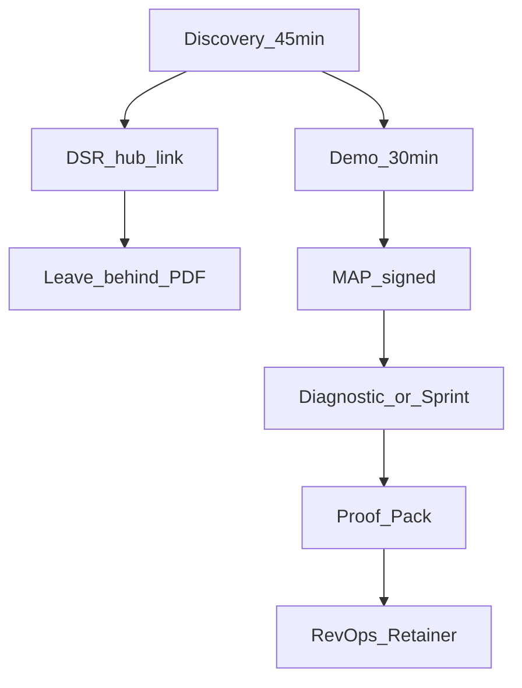

# Marketing & Presentation System — Dealix

**نظام GTM للمؤسس:** عروض، مواد تنفيذية، غرفة عميل، بريد، LinkedIn، مستثمر، وربط tokens مع الواجهة.

## ابدأ هنا

| الأولوية | الملف |
|----------|-------|
| 1 | [`FOUNDER_GTM_PLAYBOOK.md`](FOUNDER_GTM_PLAYBOOK.md) — أسبوع المؤسس + سلم العروض |
| 2 | [`presentations/live-deck-b2b-ar.md`](presentations/live-deck-b2b-ar.md) — عرض 12 شريحة |
| 3 | [`digital-sales-room/hub.html`](digital-sales-room/hub.html) — غرفة عميل |
| 4 | [`collateral/executive-one-pager-ar.html`](collateral/executive-one-pager-ar.html) — PDF للإدارة |

---

## الشجرة الكاملة

```
marketing-system/
├── FOUNDER_GTM_PLAYBOOK.md
├── brand/
│   ├── brand-tokens.yaml
│   ├── BRAND_KIT.md
│   └── marketing-shared.css
├── presentations/
│   ├── live-deck-b2b-ar.md
│   ├── leave-behind-b2b-ar.md
│   ├── appendix-technical-ar.md
│   ├── message-pack-ar.md
│   ├── SLIDE_MASTER_SPEC.md
│   ├── RTL_QA_CHECKLIST.md
│   └── committee/          # CFO · IT · RevOps
├── collateral/             # One-pager · قصة · تسعير · مقارنة
├── sales-enablement/       # Discovery · Demo · اعتراضات · إغلاق
├── email-sequences/        # بعد Discovery · Demo · Champion
├── linkedin/               # صوت المؤسس · قوالب 12 أسبوع
├── fundraising/            # مستثمر · data room · VC FAQ
├── web/                    # نسخ هبوط AR/EN
└── digital-sales-room/     # hub · MAP · INDEX
```

---

## سير عمل صفقة



---

## تحقق الإنتاج

```powershell
py -3 scripts/verify_railway_production_config.py
curl.exe -fsS https://api.dealix.me/healthz
curl.exe -fsS https://api.dealix.me/version
```

أو: [`../../scripts/smoke_production_api.ps1`](../../scripts/smoke_production_api.ps1)

---

## ربط المستودع

| موضوع | مسار |
|-------|------|
| هوية تفصيلية | [`../sales-kit/dealix_brand_guidelines.md`](../sales-kit/dealix_brand_guidelines.md) |
| حزم تجارية | [`../commercial/DEALIX_REVOPS_PACKAGES_AR.md`](../commercial/DEALIX_REVOPS_PACKAGES_AR.md) |
| فرونت إند tokens | [`../../frontend/src/styles/dealix-brand.css`](../../frontend/src/styles/dealix-brand.css) |
| NON_NEGOTIABLES | [`../00_constitution/NON_NEGOTIABLES.md`](../00_constitution/NON_NEGOTIABLES.md) |

---

## اختبارات

```bash
pytest tests/test_marketing_brand_tokens.py tests/test_health_version_endpoint.py -q
```
