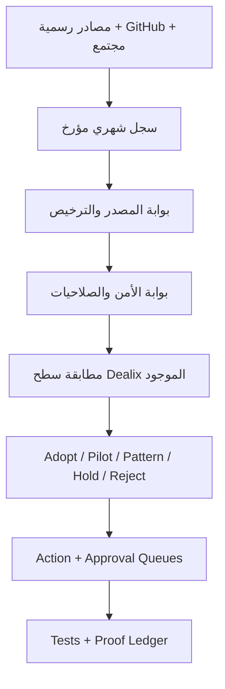

# رادار Dealix العميق للأدوات والذكاء الاصطناعي — يوليو 2026

**نافذة البحث:** 1–21 يوليو 2026 (UTC)  
**تاريخ القطع:** 21 يوليو 2026  
**مرجع التدقيق المعماري:** `Dealix-sa/dealix@984c0d1883a24c70bec34bdd215c4239b0286367`  
**رأس main عند التسليم:** `20cea2ca837d0ec0483e9478302aa36c19874744`  
**حالة التنفيذ:** تحليل + سجل آلي + اختبارات + خطة دمج؛ لا تثبيت حزم، لا نشر إنتاجي، لا إرسال خارجي، لا دمج إلى `main`.

## الخلاصة التنفيذية

فحصت 30 أداة/إصدار/مشروعًا ذا صلة مباشرة بـDealix، وفصلت بين «مفتوح المصدر فعلًا»، و«مفتوح الكود بقيود»، والخدمات المغلقة. النتيجة ليست قائمة أدوات للتركيب العشوائي، بل قرارات مرتبطة بأسطح Dealix الحالية:

- **7 عناصر P0**: تحسين مباشر أو تجربة معزولة أو نمط معماري يجب تطبيقه الآن.
- **8 عناصر P1**: تجارب صغيرة بعد قياس واضح.
- **10 عناصر P2**: مراجع أو موصلات اختيارية، لا قلب النظام.
- **5 عناصر P3**: مؤجلة/مرفوضة حاليًا.
- القرار النهائي عبر 30 عنصرًا: `adopt_now=1`، `pilot=9`، `pattern_only=10`، `connector_only=3`، `hold=3`، `reject_core=4`.

أعلى عائد لDealix الآن:

1. **تقوية Langfuse الموجود** بدل إضافة منصة مراقبة ثانية: تنقيح PII قبل الشبكة، egress allowlist، lineage، batch/retry، وفشل غير حاجب.
2. **تجربة Pydantic AI durability على تدفق واحد** فقط: تدفق تجاري قابل للاستئناف، idempotent، ومتوقف عند بطاقة موافقة قبل أي أثر خارجي.
3. **بوابة إدخال MCP آلية**: manifest + license + source + SSRF/DNS-rebinding checks + فحص MCP Trust Checker غير موثوق منفردًا.
4. **Playwright MCP في QA المعزول** وربطه بـE2E proof manifest الموجود؛ لا استخدام لحسابات المؤسس أو جلسات العملاء.
5. **رادار شهري قائم على الأدلة** يضيف `observation → entity → claim` مع المصدر، hash، الثقة، freshness، والقرار؛ هذا يطوّر Company Brain وOpportunity Graph من غير استيراد AGPL.

القرار الأهم: لا نضيف Agent OS أو CRM أو workflow engine ثانيًا. Dealix يملك بالفعل Model Router، MCP Gateway، Approval Gate، Proof Ledger، Langfuse، Playwright، وCompany OS. الأدوات الجديدة تدخل كـadapter أو pattern أو connector فقط عندما تملأ فجوة مثبتة.

## ماذا يعني «بحث شامل» هنا؟

الطلب فُسّر كبحث مفتوح المصدر ومجتمعي عميق ضمن نافذة زمنية دقيقة، وليس ادعاءً مستحيلًا بفهرسة كل منشور خاص أو محذوف على كل شبكة. التغطية شملت:

- إصدارات GitHub الرسمية ومستودعات أُنشئت داخل نافذة 1–21 يوليو.
- مدونات التغيير الرسمية لـOpenAI وGoogle وGitHub.
- إشارات المجتمع القابلة للتحقق ثم الرجوع إلى المستودع/الترخيص الأصلي.
- بحثًا عامًا عن X/Twitter؛ لم يعطِ الفهرس العام نتائج قابلة للنسبة والتأريخ بما يكفي لاستخدامها كدليل تقني. لذلك لم أرفع أي «ترند على X» إلى حقيقة منتج.
- تراخيص المستودعات ومخاطرها التجارية، لا مجرد وجود زر `Public` في GitHub.

أي مستودع جديد التقطه مرشح GitHub `created:2026-07-01..2026-07-21` ولم يُرجع الموصل يوم الإنشاء الدقيق سُجل بتاريخ `null` مع `date_precision=github_created_filter_...` بدل اختلاق يوم محدد.

## تدقيق ملفات التسليم المرفقة

| الملف | النتيجة | القرار |
|---|---|---|
| `01-OKComputer_-_PR_559.zip` | نسخة أقدم من frontend/API مع وحدات تشغيل | استخراج أفكار فقط |
| `02-OKComputer_-_PR_559_v1.zip` | build مجمّع؛ ثلاثة ملفات فقط | لا يُستخدم كمصدر هندسي |
| `03-OKComputer_-_-_-1.zip` | React/TS + Drizzle/MySQL/Kimi Auth ومسار Python `dealix/os_runtime` | لا يدمج كمنظومة موازية |
| `04-dealix_resources_p0_p50.zip` | حاوية موارد وأرشيفات متداخلة | مرجع أرشيفي فقط |
| `05-OKComputer_Dealix_OS.zip` | مطابق بايتًا للملف 03 | duplicate؛ لا يعاد إدخاله |
| `06-pasted.txt` | أسماء إعدادات Railway/Postgres وقيم محجوبة | لا أسرار مكشوفة؛ لا تغيير إنتاجي |

الملفان 03 و05 متطابقان بالـSHA-256. كما أن المواد تعود إلى 1 يونيو، بينما `main` الحالي وصل إلى commit بتاريخ 17 يوليو، وPR #922 سبق أن سجّل intake الأرشيف ورفض إدخال runtime موازٍ كامل. لذلك القرار الصحيح هو نقل القدرات، لا نقل البنية:

| قدرة من الأرشيف | سطح Dealix الحالي | طريقة الاستفادة |
|---|---|---|
| `approval_gate` | Approval Queue / MCP Gateway | مقارنة القواعد وإضافة الاختبارات الناقصة فقط |
| `anti_ban_guardian` | سياسة المصادر/المعدل | تحويله إلى rate-limit وdomain policy، لا أتمتة التفاف |
| `channel_router` | Workload/Channel Router | نقل taxonomy إن كانت أوسع، لا استبدال الراوتر |
| `company_scorer` | Company Targeting / Opportunity Graph | توحيد السمات مع proof/freshness |
| `offer_router` | Commercial Strategy / Finance Gate | ربط القرار بهامش الربح والأدلة |
| `persuasion_dossier` | Draft Queue | توليد مسودة فقط؛ لا إرسال |

## خط الأساس الحقيقي للمستودع

في `main@984c0d1` توجد نقاط الاندماج الآتية بالفعل:

- `core/llm/inference.py`: مدخل آمن عبر `ModelRouter` مع فشل صريح عند غياب provider.
- `core/observability/langfuse_integration.py`: تتبع calls/actions/cost، لكنه يحتاج redaction وbatch/retry وحدود egress أقوى.
- `mcp_server/` و`docs/agents/DEALIX_MCP_GATEWAY_POLICY.md`: بوابة MCP وحظر افتراضي للوصول المباشر والإرسال الخارجي.
- `docs/security/MCP_TOOL_RISK_POLICY.md`: tiers من T0 إلى T7، manifest، secret leakage، poisoning.
- `auto_client_acquisition/proof_ledger/`: سجل إثبات Postgres ومخططات.
- `scripts/dealix_e2e_smoke_manifest.py`: تحقق من Playwright config وproduction smoke.
- `scripts/agents/external_agent_stack_radar.py`: رادار سابق dependency-free، ويمكن تحويل سجل يوليو الجديد إلى مصدره المتجدد.
- `docs/v10/DEPENDENCY_DECISION_RECORD.md`: أي dependency حقيقية تتطلب شروط أهلية وتوقيع المؤسس.

الحالة المرصودة لمرجع التدقيق: Railway وVercel ناجحان. أثناء تجهيز التسليم دُمج تنظيف الهوية/الأرشيف إلى `main` في `20cea2c`، وبقي #924 لمسار التشخيص المجاني. لذلك وُضعت حزمة يوليو في PR وثائقي/registry مستقل ولا تختلط مع التسعير أو التنفيذ التجاري.

## طبقة القرار المقترحة



قواعد الترقية:

1. الإشارة الاجتماعية لا تصبح claim حتى ترتبط بمصدر رسمي.
2. المشروع العام ليس بالضرورة مفتوح المصدر: ELv2 وSustainable Use وhybrid وproprietary تُعامل منفصلة.
3. AGPL لا ينسخ داخل Dealix بلا مراجعة؛ تؤخذ الفكرة clean-room أو يبقى النظام خدمة منفصلة بشروط واضحة.
4. أي أداة browser/shell/MCP تبدأ fake-data/read-only/domain-allowlisted.
5. لا يتحول `pilot` إلى dependency قبل وجود benchmark، rollback، owner، expiry، وقرار موثق.

## الرادار: أعلى الأولويات

### P0 — افعل الآن ضمن حدود آمنة

| العنصر | ما نزل في يوليو | القرار | ربطه بـDealix |
|---|---|---|---|
| [Langfuse](https://github.com/langfuse/langfuse/releases) | تحسينات trace/dashboard/retention/auth/egress في 3.220–3.221 | `adopt_now` للموجود | تقوية `core/observability`؛ لا Phoenix موازٍ |
| [Pydantic AI](https://github.com/pydantic/pydantic-ai/releases) | durability عبر Temporal/DBOS/Prefect، deferred events، durable tool IDs؛ مع advisory أمني AG-UI | `pilot` | تدفق موافقة واحد قابل للاستئناف، بإصدار مصحح |
| [FastMCP](https://github.com/PrefectHQ/fastmcp/releases) | 3.4.3 hardening لـSSRF/DNS rebinding/OAuth، ثم defaults أكثر تساهلًا في 3.4.4 | `pilot` | trusted hosts/origins صريحة فوق MCP Gateway الحالي |
| [Playwright MCP](https://github.com/microsoft/playwright-mcp/releases) | `browser_find`، snapshots أقل كلفة، mobile emulation، sandbox fixes | `pilot` | QA فقط وربط الأدلة بـE2E manifest |
| [MCP Trust Checker](https://github.com/illiahaidar/mcptrustchecker) | ماسح محلي deterministic جديد؛ ادعاءات 78 rule/304 tests تحتاج تحققًا مستقلاً | `pilot` | فحص مساعد لا يمنح approval آليًا |
| [Google ADK 2.0](https://developers.googleblog.com/why-we-built-adk-20/) | workflow runtime، deterministic routing، HITL، strict state boundaries | `pattern_only` | اجعل code يملك routing/permissions والـLLM يملك reasoning/drafting فقط |
| [Agent Pulse](https://github.com/barretlee/agent-pulse) | نموذج رادار evidence/context/impact/next signals | `pattern_only` | schema شهري لـCompany Brain وSelf Improvement |

### P1 — تجارب محدودة بعد بوابة واضحة

| العنصر | الفائدة | القرار والحد |
|---|---|---|
| [OpenAI Agents SDK](https://github.com/openai/openai-agents-python/releases) | تحسينات يوليو في tracing، sessions، provider isolation، strict handoffs | patterns/adapter فقط خلف ModelRouter |
| [GPT‑5.6](https://openai.com/index/gpt-5-6/) | provider اختياري لمقارنة العربية/الاستدلال | 30 حالة، سقف تكلفة، لا default switch |
| [Nango](https://github.com/NangoHQ/nango/releases) | connector coverage وegress/audit/MCP Auth | connector فقط؛ ELv2 ومراجعة قانونية |
| [OpenNous](https://github.com/NousC/opennous) | observations/entities/claims مع confidence/freshness | clean-room schema فقط؛ AGPL |
| [VulnHunter](https://github.com/capitalone/VulnHunter) | hunt → falsify → fix → independent verify | مختبر مصرح ومعزول؛ verifier read-only أولًا |
| [Ollama](https://github.com/ollama/ollama/releases) | 0.31.2–0.32.1: tool calling/cache/GGUF/older-GPU fixes وagent CLI | اختبار ترقية محلي؛ إبقاء 7B حتى يفوز بديل مرخص |
| [Browser Use](https://github.com/browser-use/browser-use/releases) | Browser Harness/CLI ومشغل MCP وتحسينات reliability | بحث عام/QA فقط؛ Playwright هو الافتراضي |
| [GitHub Copilot July](https://github.blog/changelog/label/copilot/) | browser/vision GA، model routing، OTel، code-scanning autofix preview | budgets + OTel + draft PR/human review |

### P2 — مرجع أو موصل، لا قلب النظام

- [LangGraph](https://github.com/langchain-ai/langgraph/releases): checkpoints/resume كمرجع؛ runtime بعد فشل إنتاجي موثق فقط.
- [MCP TypeScript SDK 2 beta](https://github.com/modelcontextprotocol/typescript-sdk/releases): migration note فقط حتى stable.
- [n8n](https://github.com/n8n-io/n8n/releases): customer-owned execution plane بشروط، لا DB مباشر ولا إرسال بلا approval؛ ترخيص fair-code.
- [Twenty](https://github.com/twentyhq/twenty/releases): تكامل CRM اختياري، لا استبدال Dealix ولا embedding؛ AGPL/enterprise.
- [Phoenix](https://github.com/Arize-ai/phoenix/releases): regression-gate ideas فقط؛ ELv2 وازدواج مع Langfuse.
- [llama.cpp](https://github.com/ggml-org/llama.cpp/releases): يستهلك عبر Ollama المثبت، لا runtime محلي ثانٍ.
- [AWS Labs Loom](https://github.com/awslabs/loom): scoped identity/approval/cost patterns؛ لا ترحيل AWS.
- [AgentSmith](https://github.com/PromptPartner/agentsmith): مقارنة قواعد التطوير وإضافة النقص فقط.
- [Browser Memory](https://github.com/browser-memory/bmem): كتالوج وصفات غير موثوق تلقائيًا؛ مراجعة يدوية.
- [Memmy Agent](https://github.com/MemTensor/memmy-agent): user-controlled memory patterns؛ لا ابتلاع sessions أو history خام.

### P3 — مؤجل أو مرفوض حاليًا

| العنصر | السبب |
|---|---|
| [vLLM 0.25](https://github.com/vllm-project/vllm/releases) | ممتاز لخادم GPU، لا يلائم جهاز 7 GB ولا بنية Railway/Vercel الحالية |
| [browser-control](https://github.com/anomalyco/browser-control) | يتحكم بملف متصفح logged-in؛ ambient authority غير مقبولة في core/CI/server |
| [Tencent Octop](https://github.com/TencentCloud/Octop) | Agent OS موازٍ مع browser/shell/memory؛ ازدواج وتوسيع صلاحيات |
| [Open Kritt](https://github.com/Kritt-ai/open-kritt) | root + containers + direct internet + AGPL؛ مختبر disposable مستقل فقط إن لزم |
| [fastctx](https://github.com/yc-duan/fastctx) | الترخيص غير متحقق؛ لا install قبل license/build/security review |

## خطة الدمج التفصيلية

### المسار A — يوليو رادار يصبح نظامًا شهريًا

**الملفات المقترحة داخل المستودع:**

- `dealix/registers/tool_intake_july_2026.json`
- `scripts/agents/verify_tool_intake.py`
- `tests/test_tool_intake.py`
- `docs/research/JULY_2026_OPEN_SOURCE_RADAR_AR.md`

**الحقول الأساسية:** `source`, `license`, `license_source`, `signal_date/date_basis`, `decision`, `priority`, `dealix_surfaces`, `integration`, `gates`.

**Definition of done:** validator يرفض ID مكررًا، تاريخًا خارج النافذة، URL غير HTTPS، license غير متحقق مع قرار غير `hold`، أو سطحًا حساسًا بلا guard.

### المسار B — MCP Trust Gate

1. كل MCP يدخل بmanifest Dealix الحالي.
2. pin إلى commit/release؛ لا `latest` في CI.
3. license check + dependency/SBOM + secret scan.
4. SSRF cases: private ranges، IPv6 transition ranges، redirects، DNS rebinding.
5. trusted host/origin allowlist صريحة حتى لو runtime defaults متساهلة.
6. fake data ثم read-only public data.
7. T0/T1/T2 فقط في المرحلة الأولى؛ T3+ requires approval card.
8. كل call ينتج audit/proof event مع provenance وtimeout/rate limit.

### المسار C — Langfuse hardening بدل Phoenix

الثغرات التشغيلية الظاهرة في integration الحالي:

- prompt/response يُقتطع فقط؛ لا يظهر redactor سابق للشبكة.
- كل event ينشئ `aiohttp.ClientSession` منفصلًا؛ لا pooling/batch واضح.
- errors تُخفى في debug، ولا dead-letter/metric لإخفاق التصدير.
- endpoint يدوي قد ينحرف عن SDK/API versions.

التحسين المقترح:

`redact → allowlisted payload → bounded queue → batch/retry+jitter → export → delivery metric`، مع feature flag افتراضي off في البيئات غير المهيأة، وبدون جعل failure يعطل business flow.

### المسار D — Durable approval pilot

تدفق واحد فقط، مثل `research signal → score → draft opportunity → approval card → proof event`:

- state machine صريحة.
- idempotency key لكل خطوة.
- resume بعد crash.
- لا network send في الاختبار.
- LLM لا يقرر transition الحساسة؛ code يفعل.
- نتيجة Pydantic typed تدخل السجل بعد validation.
- قياس: success/resume rate، duplicate side effects=0، latency، tokens، manual review time.

### المسار E — Browser QA

- Profile disposable، لا cookies شخصية.
- preview/staging فقط.
- allowlist للنطاقات.
- Playwright assertions deterministic أولًا؛ MCP يساعد على discovery/accessibility snapshot فقط.
- إرفاق screenshot/status/trace كدليل، دون ادعاء customer flow ناجح إذا لم يمر assertion.

### المسار F — Opportunity Graph أكثر دقة

نستفيد من OpenNous/Agent Pulse كمفهوم من غير نسخ كود AGPL:

```text
Observation (immutable source event)
  -> Entity (company/person/tool/market)
  -> Claim (statement + confidence + freshness + evidence hash)
  -> Impact (Dealix surface + expected value)
  -> Decision (adopt/pilot/hold/reject)
  -> Action (owner + due + approval + proof)
```

هذا يربط الرادار بـCompany Brain وContacts Radar وOpportunity Graph وSelf-Improvement، ويمنع أن تصبح الأخبار «حقائق دائمة» بعد انتهاء صلاحيتها.

## Action Queue المقترحة

| ID | الأولوية | العمل | المالك | المدة | الأثر الخارجي | بوابة الإنهاء |
|---|---|---|---|---:|---|---|
| JR-01 | P0 | إدخال registry + validator + tests | Engineering | 0.5 يوم | لا | 5 tests + CI |
| JR-02 | P0 | Langfuse redaction/queue/egress design | Trust/Engineering | 1 يوم | لا عند التصميم | security review |
| JR-03 | P0 | MCP manifest schema v2 + SSRF cases | Security | 1 يوم | لا | fake-data suite |
| JR-04 | P0 | Playwright MCP preview pilot | QA | 0.5 يوم | staging read-only | evidence pack |
| JR-05 | P0 | durable approval workflow spike | Company OS | 1–2 يوم | لا | resume/idempotency |
| JR-06 | P1 | 30-case model routing eval لـGPT‑5.6/local/GLM | AI Platform | 1 يوم | API مدفوع عند الموافقة | budget + results |
| JR-07 | P1 | Ollama 0.32.1 local regression | AI Platform | 0.5 يوم | لا | RAM/quality/rollback |
| JR-08 | P1 | Nango legal/security connector brief | Connectors | 0.5 يوم | لا | ELv2+DPA decision |
| JR-09 | P1 | OpenNous clean-room schema ADR | Intelligence | 0.5 يوم | لا | legal note + migrations |
| JR-10 | P1 | VulnHunter verifier-only lab | Security | 0.5–1 يوم | لا | authorized target + evidence |
| JR-11 | P2 | SDK 2 beta watch item | MCP owner | شهري | لا | stable release only |
| JR-12 | P2 | close/reject duplicate runtime proposals | Architecture | مستمر | لا | dependency record |

## Approval Queue

لا تحتاج موافقة الآن: كتابة registry/tests/docs، تحليل التراخيص، تصميم schemas، fake-data tests، إضافة issue وDraft PR.

تحتاج قرار المؤسس قبل التنفيذ:

1. تمكين/ترقية Langfuse فعليًا إذا سيصدر traces خارج بيئة Dealix.
2. أي استدعاء GPT‑5.6 مدفوع أو تغيير default model route.
3. Nango managed/self-hosted واختيار نموذج الترخيص/معالجة البيانات.
4. تشغيل browser agent على staging يتطلب credentials.
5. تشغيل VulnHunter أو Kritt على أي target حقيقي.
6. إدخال أي AGPL ككود أو خدمة معدلة.
7. أي MCP بأكثر من read-only أو أي outbound action.

## المخاطر التي تمنع «ركّب كل شيء»

| الخطر | الأدوات المتأثرة | المعالجة |
|---|---|---|
| ازدواج runtime | ADK، LangGraph، Octop، Loom، Agents SDK | pattern/adapter؛ gap أولًا |
| ambient browser authority | browser-control، Browser Use، Playwright MCP | disposable profile + allowlist + no customer session |
| prompt/tool poisoning | MCP servers، bmem | manifest review + output firewall + no auto-install |
| SSRF/DNS rebinding | FastMCP وأي fetch tool | strict origins/hosts + network tests |
| copyleft/field-of-use | OpenNous، Twenty، Open Kritt، Nango، Phoenix، n8n | legal gate + connector/clean-room/hold |
| PII leakage | Langfuse، model APIs، connector gateways | redaction before network + minimization + retention |
| cost runaway | GPT‑5.6، Copilot، VulnHunter/Opus، GPU/vLLM | per-run/session budget + usage telemetry |
| false confidence | new scanners/radars | independent reproduction + Proof Ledger |

## Proof Log

| الدليل | النتيجة |
|---|---|
| حدود البحث | 2026-07-01..2026-07-21 UTC |
| عدد عناصر registry | 30 |
| ترخيص MIT | 14 |
| Apache-2.0 | 6 |
| AGPL variants | 3 |
| ELv2 | 2 |
| fair-code/hybrid/proprietary/unverified | 5 |
| validator | PASS |
| unit tests | 5/5 PASS |
| مرجع التدقيق المعماري | `984c0d1883a24c70bec34bdd215c4239b0286367` |
| رأس main عند التسليم | `20cea2ca837d0ec0483e9478302aa36c19874744` |
| deployment statuses observed | Railway success؛ Vercel success |
| archive duplicate | 03 = 05 بالـSHA-256 |
| external actions | 0 |
| dependencies installed | 0 |
| production changes | 0 |

## القيود والشفافية

- لا يمكن لأي بحث عام إثبات أنه جمع «كل» منشور على جميع الشبكات؛ الحسابات الخاصة، الحذف، وقيود الفهرسة تمنع ذلك.
- X/Twitter لم يوفر عبر الفهرسة العامة إشارات يوليو قابلة للتأريخ والنسبة بثقة كافية؛ لذلك جرى استبعاده كمصدر claims، لا تجاهله كقناة مستقبلية.
- أرقام الاختبارات التي تذكرها مشاريع جديدة مثل MCP Trust Checker هي ادعاءات من README حتى يُشغّل repo pinned داخل مختبر مستقل.
- لم تُشغّل أدوات dual-use، ولم تُفتح جلسات متصفح مسجلة، ولم تُستخدم أسرار Railway.
- لم تُثبت أي dependency؛ هذه المرحلة تبني decision system وproof، ثم تنتقل التجارب المعزولة بموافقة.

## أعلى خطوة تالية

دمج PR الرادار بعد المراجعة يفتح مباشرة JR-02 وJR-03: Langfuse hardening وMCP trust gate. هما أعلى عائد لأنهما يرفعان الثقة في كل Agent/Connector لاحق بدل إضافة أداة واحدة فقط.

## المصادر الأولية الرئيسية

- [OpenAI Agents SDK releases](https://github.com/openai/openai-agents-python/releases) و[GPT‑5.6](https://openai.com/index/gpt-5-6/)
- [Pydantic AI releases](https://github.com/pydantic/pydantic-ai/releases)
- [Google ADK 2.0](https://developers.googleblog.com/why-we-built-adk-20/)
- [FastMCP releases](https://github.com/PrefectHQ/fastmcp/releases) و[MCP TypeScript SDK](https://github.com/modelcontextprotocol/typescript-sdk/releases)
- [Playwright MCP](https://github.com/microsoft/playwright-mcp/releases) و[Browser Use](https://github.com/browser-use/browser-use/releases)
- [Langfuse](https://github.com/langfuse/langfuse/releases) و[Phoenix](https://github.com/Arize-ai/phoenix/releases)
- [Nango](https://github.com/NangoHQ/nango/releases)، [n8n](https://github.com/n8n-io/n8n/releases)، [Twenty](https://github.com/twentyhq/twenty/releases)
- [Ollama](https://github.com/ollama/ollama/releases)، [vLLM](https://github.com/vllm-project/vllm/releases)، [llama.cpp](https://github.com/ggml-org/llama.cpp/releases)
- [GitHub Copilot changelog](https://github.blog/changelog/label/copilot/)
- [Capital One VulnHunter](https://github.com/capitalone/VulnHunter)
- بقية المستودعات وروابط الترخيص مفهرسة آليًا في `dealix_july_2026_tool_radar.json`.
